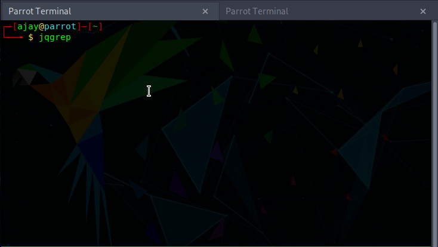

# jqgrep 

jq wrapper script for parsing json files generated by various tools.  

## Installation

Copy the whole code from [jqgrep.sh](jqgrep.sh) file amd paste/append it on your `.bashrc` file. It is usually located on home directory '~/.bashrc'.  

## How to Use  

  

## Currently supported tools with pattern

- [**ffuf**](#ffuf)


#### [ffuf](https://github.com/ffuf/ffuf) 

1st pattern : Prints urls with status code 200 in "url [status]" format. 

```js  
.results[]|select(.status==200)|"\(.url) [\(.status)]"
```  

2nd pattern : Prints urls with status code 200|300|301|302 in "url [status]" format.  

```js  
.results[]|select(.status==200),select(.status==300),select(.status==301),select(.status==302)|"\(.url) [\(.status)]"
```  

3rd pattern : Prints urls with status code 300|301|302 in "url [status] redirectLocation" format.  

```js  
.results[]|select(.status==300),select(.status==301),select(.status==302)|"\(.url)  [\(.status)]  \(.redirectlocation)"  
```  
